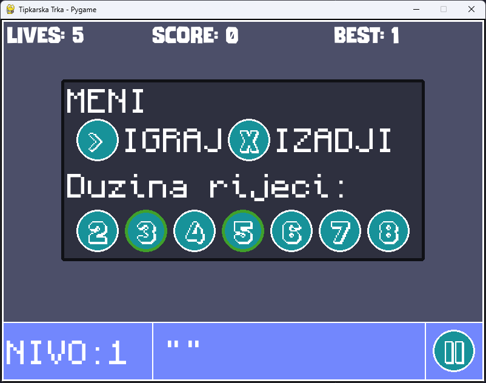
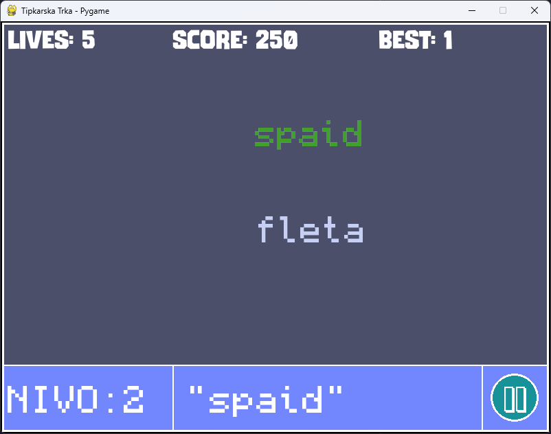

<h1 align="center">Tipkarska Trka</h1>

<p align="center">
   
   Izgled menija igre
</p>

## Kratki opis igre

**Tipkarska Trka** je edukativna igra koja testira brzinu i preciznost kucanja. Cilj igre je da korisnici kucaju sve riječi koje se pojavljuju u toku igre. Na početku, u prvom "nivo" (krugu), pojavljuje se samo jedna riječ, u sledećem krugu dve riječi, i tako redom kako igra napreduje. Broj riječi se povećava sa svakim sljedećim krugom, čineći igru sve težom.

<p align="center">
   
   Gameplay u kome riječi iskaču nasumično
</p>

Igra je **singleplayer**, gdje se korisnik takmiči protiv života i svojih veština u tipkanju. Igra traje dok korisnik ne završi sve reči ili dok ne izgubi sve živote. Ako korisnik izgubi sve živote, igra se vraća na **pauzirani meni**, a korisnik može ponovo da krene od početka.

## Inspiracija

Inspiraciju za igru pružili su tradicionalni testovi brzine kucanja koji se koriste u različitim disciplinama, ali sa dodatkom zabavnog aspekta takmičenja. Takođe, značajan izvor inspiracije bila je i igra **MonkeyType**, koja je poznata po tome što testira brzinu kucanja korisnika, ali na fiksiran način — igrači imaju unaprijed zadane riječi koje moraju da upišu. U ovoj igri uveden je elemenat dinamike i izazovnosti, jer riječi iskaču na ekran random brzinom. Cilj je stvoriti alat koji pomaže korisnicima da poboljšaju svoje vještine kucanja, dok se istovremeno zabavljaju.

## Preduslovi za korišćenje

Za pokretanje igre, potrebno je da imate sljedeće instalirano:

1. [Python 3.11 ili novija verzija](https://www.python.org/downloads/)
2. [git](https://git-scm.com/downloads)
3. [uv](https://github.com/astral-sh/uv) - Python alat za menadžment biblioteka i python verzija

## Instalacija

1. Klonirajte ovaj repozitorijum na svoj lokalni računar:
   ```bash
   git clone https://github.com/Emcho0/tipkarska_trka.git
   ```
2. Uđite u direktorijum i sinhronizujte biblioteke i Python verzije ako to već niste uradili:
   ```bash
   cd tipkarska_trka && uv sync
   ```
3. Pokrenite igru:

Ako koristite _nltk_ biblioteku prvi put, potrebno je da preuzmete neophodne resurse. Otkomentarišite sledeće linije u kodu:

```python
import nltk
nltk.download("words")
```

I zatim uz pomoć uv pokrenite igru

```bash
   uv run main.py
```

**Savjet:** Ako ste prvi put koristili alat **`uv`**, možete pratiti dokumentaciju na [uv GitHub stranici](https://github.com/astral-sh/uv) za više informacija o konfiguraciji i upravljanju okruženjem.
