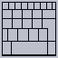
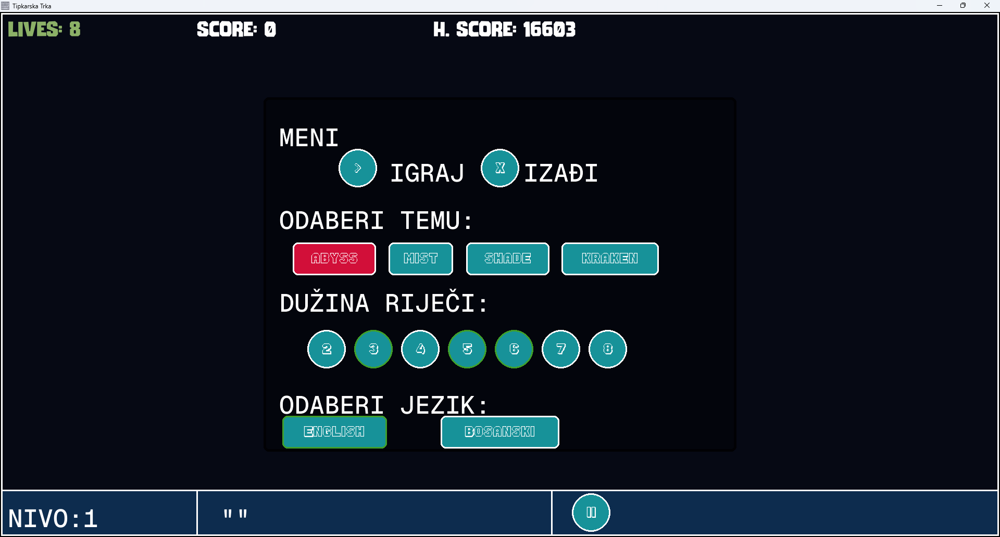

<h1 align="center" valign="middle">
  

<sup>Tipkarska trka</sup>

</h1>

## Opcije za odabir tema - Yorumi [ Abyss, Mist, Shade, Kraken ]

|  |  |
| ------------------------------------ | ------------------------------------ |
| yorumi abyss                         | yorumi mist                          |
|  |  |
| yorumi shade                         | yorumi kraken                        |

## Kratki opis igre

**Tipkarska Trka** je edukativna igra koja testira brzinu i preciznost kucanja.
Cilj igre je da korisnici kucaju sve riječi koje se pojavljuju tokom igre. Na
početku, u prvom "nivo" (krugu), pojavljuje se samo jedna riječ, u sljedećem
krugu dvije riječi, i tako redom kako igra napreduje. Broj riječi povećava se sa
svakim sljedećim krugom, čineći igru sve zahtjevnijom.

Igra je **singleplayer**, gdje se korisnik takmiči protiv vremena i svojih
vještina tipkanja. Igra traje dok korisnik ne završi sve riječi ili dok ne
izgubi sve živote. Ako korisnik izgubi sve živote, igra se vraća na **pauzirani
meni**, a korisnik može započeti iznova.

## Inspiracija

Inspiraciju za igru pružili su tradicionalni testovi brzine tipkanja koji se
koriste u različitim disciplinama, ali sa dodatkom zabavnog aspekta takmičenja.
Također, značajan izvor inspiracije bila je i igra **MonkeyType**, koja je
poznata po tome što testira brzinu tipkanja korisnika, ali na unaprijed
definiran način — igrači imaju zadane riječi koje moraju upisivati. U ovoj igri
uveden je element dinamike i izazovnosti, jer riječi iskaču na ekranu nasumičnom
brzinom. Cilj je stvoriti alat koji pomaže korisnicima da poboljšaju svoje
vještine tipkanja, dok se istovremeno zabavljaju.

## Preduslovi za upotrebu ovog repozitorija i igranje igre

Za pokretanje igre potrebno je da imate sljedeće instalirano:

1. [Python 3.12 ili noviju verziju](https://www.python.org/downloads/)
2. [git](https://git-scm.com/downloads)
3. [uv](https://github.com/astral-sh/uv) - Python alat za upravljanje
   bibliotekama i verzijama

## Instalacija

1. Klonirajte ovaj repozitorij na svoj lokalni računar:

   ```bash
   git clone https://github.com/Emcho0/tipkarska_trka.git
   ```

2. Instalirajte uv uz pomoć installera ili pip-a:

   ```bash
   pip install uv

   # Za windows

   powershell -ExecutionPolicy ByPass -c "irm https://astral.sh/uv/install.ps1 | iex"

   # Za Linux i macOS

   curl -LsSf https://astral.sh/uv/install.sh | sh
   ```

3. Uđite u direktorij i sinhronizirajte biblioteke i Python verziju, ako to već
   niste učinili:

```bash
cd tipkarska_trka
uv sync
```

4. Pokrenite igru:

```bash
uv run main.py
```

## Igranje same igre

<p align="center" valign="middle">
   
    Prikazivanje bosanskih riječi
</p>

<p align="center" valign="middle">
   
    Prikazivanje engleskih riječi
</p>

> Tema koja je upotrijebljena je [`yorumi`](https://github.com/yorumicolors) i
> dodana je treća tema `fog` kao tema koja je svijetlija varijanta `abyss` teme.
